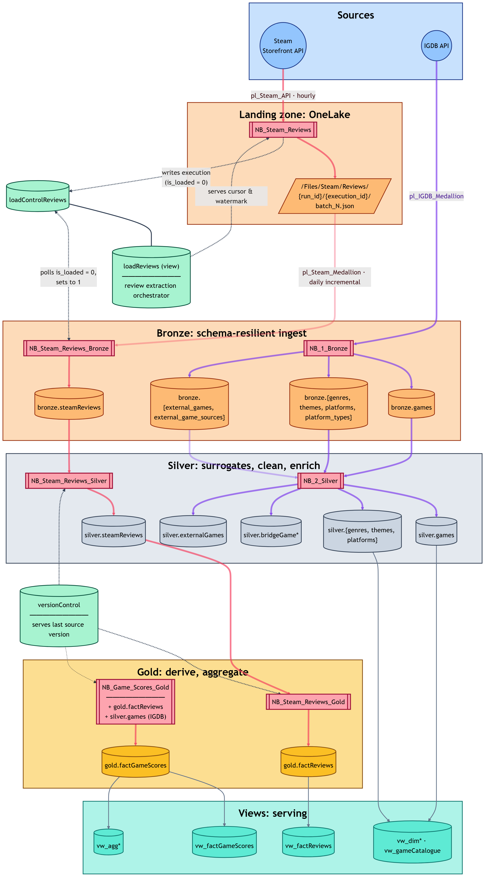
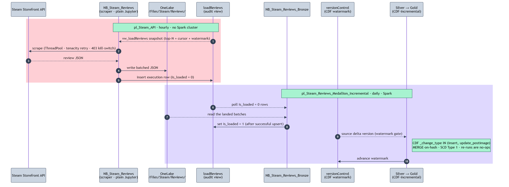

# Altanwir architecture overview

Altanwir is a Medallion lakehouse (Bronze → Silver → Gold) on Microsoft Fabric that ingests 71M Steam reviews and the IGDB metadata catalog, scores every review for sentiment, and rolls the signals up to game grain. It ran end-to-end (bronze to gold) in 2h 28m on a single 8-core trial cluster and runs CDF-incremental after that. Fabric's SQL analytics endpoint can't surface complex types, which pushed the whole Gold layer to flat dimensional modelling ([adr-001](../adrs/adr-001-dimensional-gold-over-array-obt.md)). This overview walks the pipeline end to end: the layer architecture and control plane, the Gold data model, the engineering patterns behind it, and what's deliberately out of scope.

## Contents

- [Architecture](#architecture)
  - [Diagram](#diagram)
  - [Pipelines](#pipelines)
  - [Layer contracts](#layer-contracts)
  - [Environments](#environments)
  - [Run-time profile](#run-time-profile-prod-2026-04-23)
  - [Control plane (+ incremental-handshake diagram)](#control-plane)
  - [Notebook responsibilities](#notebook-responsibilities)
- [Data model](#data-model)
  - [Schema map](#schema-map)
  - [Field lineage, review grain](#field-lineage-review-grain-bronze--gold-review)
- [Engineering patterns](#engineering-patterns)
  - [Idempotency and change tracking](#idempotency-and-change-tracking)
  - [Performance under scale](#performance-under-scale)
  - [Modelling discipline](#modelling-discipline)
  - [Schema resilience](#schema-resilience)
  - [Extraction and control plane](#extraction-and-control-plane)
  - [Operational quirks](#operational-quirks)
- [What's not in the repo](#whats-not-in-the-repo)
  - [Out of scope by design](#out-of-scope-by-design)
  - [First-iteration code](#first-iteration-code)

## Architecture

Two source systems feed the lakehouse: the Steam Storefront API for reviews and the IGDB metadata catalog. Four Data Factory pipelines orchestrate ingestion; a separate Fabric SQL Warehouse sits off the Spark cluster as the audit and load-control plane (see [adr-002](../adrs/adr-002-cdf-incremental-audit-warehouse.md)).

### Diagram

Source: [`diagrams/architecture.mmd`](diagrams/architecture.mmd).

#### Legend

**Arrow colors:**

| Visual | Meaning |
|---|---|
|  rose | Steam medallion pipeline |
|  violet | IGDB medallion pipeline |
|  slate solid | View derivation (Gold → serving views) |
|  slate dotted | Audit-warehouse + CDF-watermark connections (control plane) |

**Node shapes:**

| Visual | Meaning |
|---|---|
| `[("text")]` cylinder | Delta table or view |
| `[["text"]]` double-bracket brick | Notebook |
| `[/"text"/]` slashed parallelogram | File path |
| `(("text"))` circle | External API |

**Floating nodes.** `loadReviews`, `loadControlReviews`, and `versionControl` are audit tables living in the `IGDBAudit` Fabric Warehouse.

### Pipelines

| Pipeline | Stages | Notes |
|---|---|---|
| `pl_IGDB_Medallion` | `NB_1_Bronze` → `NB_2_Silver` → `NB_Game_Scores_Gold` | IGDB reload; Silver/Gold gated on Bronze's `processed_any = true` exit signal |
| `pl_Steam_API` | `NB_Steam_Reviews` (extractor only) | Plain Jupyter (`python3.11`), not Spark. No cluster spin-up for the API fetch ([adr-002](../adrs/adr-002-cdf-incremental-audit-warehouse.md)). Writes batched JSON to OneLake `/Files/Steam/Reviews/` and marks every execution in `steam.loadControlReviews`. ([adr-009](../adrs/adr-009-review-scraper-bronze-loader-decoupling.md)) |
| `pl_Steam_Reviews_Medallion` | `NB_Steam_Reviews_Bronze` → `_Silver` → `_Gold` → `NB_Game_Scores_Gold` | Full reload of a game cohort |
| `pl_Steam_Reviews_Medallion_Incremental` | `NB_Steam_Reviews` → Bronze → Silver → Gold → GameScores | Default `load_type = incremental`; CDF-driven |

`NB_Game_Scores_Gold` is shared between the two terminal pipelines and idempotent (~30k rows, MERGE-on-hash). Re-running it from either chain costs nothing when no upstream rows changed. That property is what makes the two-pipeline split workable.

In narrative form, with the operational detail per pipeline:

- **`pl_Steam_API`.** Runs hourly. `NB_Steam_Reviews` reads the `vw_loadReviews` snapshot view (top-N games + cursor + watermark), scrapes the Steam Storefront API, writes batched JSON to OneLake (`/Files/Steam/Reviews/{load_type}/{run_id}/{execution_id}/`), and logs each execution into `loadControlReviews` with `is_loaded = 0`.
- **`pl_Steam_Reviews_Medallion_Incremental`.** Runs daily. `NB_Steam_Reviews_Bronze` polls the audit warehouse for `is_loaded = 0` rows, MERGEs the corresponding JSON files into `bronze.steamReviews`, then flips the flag to `1`. Silver and Gold notebooks then run CDF-incremental, gated by the `versionControl` watermark.
- **`pl_Steam_Reviews_Medallion`.** Full-reload variant of the above; same notebook chain, different `load_type`.
- **`pl_IGDB_Medallion`.** Runs IGDB metadata reload. `NB_1_Bronze` ingests every IGDB endpoint in use (with `autoMerge` for schema evolution), then `NB_2_Silver` builds the dim + bridge tables.

`NB_Steam_Reviews_Silver` also broadcast-joins `silver.externalGames` to resolve `gameKey` for every Steam review (cross-pipeline lookup, not shown as an edge in the diagram). The audit-warehouse mechanics behind these pipelines are described in [§Control plane](#control-plane) below.

### Layer contracts

- **Bronze.** Schema-resilient ingest.
  - Steam: raw payload preserved as a single `review_json STRING`; MERGEs only the batches the scraper has landed in `/Files/Steam/Reviews/`, polling `steam.loadControlReviews WHERE is_loaded = 0` for the read set.
  - IGDB: explicit-exclude config dict, `ArrayType` cast to STRING pre-write, session-level `delta.schema.autoMerge.enabled = true` so new fields land without DDL.
  - Cadence decoupled: scraper runs hourly (under Steam's rate limits); Bronze fires once daily and picks up whatever accumulated.

- **Silver.** Clean, enrich, score.
  - Reviews: parse JSON → English-only → dedup `(app_id, steamid)` → 8-step text-cleaning chain for VADER readiness → engineered quality columns (`isVaderEligible`, `hasCredibleText`, etc.) → VADER as `pandas_udf`.
  - IGDB: dim and bridge build; broadcast-join `externalGames` to resolve `gameKey` into Steam Reviews.
  - Surrogate keys are created for every entity using SHA-256

- **Gold.** Derive, aggregate, serve.
  - Review-grain [signal columns](scoring-model.md#score-composition-diagram) + per-game-normalised [`reviewInfluenceScore`](scoring-model.md#score-composition-diagram).
  - Game-grain [influence-weighted aggregates](scoring-model.md#score-composition-diagram) with [shrinkage](scoring-model.md#score-composition-diagram).
  - All metrics flat, no complex types ([adr-001](../adrs/adr-001-dimensional-gold-over-array-obt.md)); presentation logic in serving views ([adr-004](../adrs/adr-004-percentiles-in-views.md), [adr-008](../adrs/adr-008-store-wide-expose-narrow.md)).

- **Common contract** (all layers).
  - MERGE keyed on natural or surrogate hash; `whenMatchedUpdateAll` (or explicit column mapping where run-id semantics matter) only when the row hash differs.
  - SCD Type 1, no destructive ops.
  - `insert_run_id` / `update_run_id` lineage column on every row.

### Environments

| Env | Lakehouse | Audit schema | Scale |
|---|---|---|---|
| dev  | `IGDBAnalytics_Dev` | `dev`   | ~7M reviews |
| prod | `IGDBAnalytics`     | `steam` | ~71M reviews at Bronze |

Both lakehouses share the same Fabric trial F-capacity (one Spark cluster at a time). The split into separate lakehouses + audit schemas is deliberate: it lets the production scrape keep accumulating reviews uninterrupted while dev iteration continues, instead of partitioning a single lakehouse with a `load_type` flag and risking dev runs polluting prod state. Steam Reviews notebooks switch via a single `environment` parameter; the older IGDB notebooks predate the pattern and use hardcoded names (see §What's not in the repo).

### Run-time profile (prod, 2026-04-23)

> [!NOTE]
> **71.1M reviews end-to-end in ≈ 2h 28m** on a single 8-core Fabric trial F-cluster.
> Bronze 40m → Silver 1h 29m (VADER + demoji `pandas_udf`) → Gold review 12m → game-grain Gold 2m. A 120s wait sits between every Spark notebook because trial capacity allows only one cluster at a time.

### Control plane

The audit warehouse (`IGDBAudit`, separate Fabric SQL Warehouse, accessed via pyodbc + PBI OAuth) holds `loadControlReviews` (per-execution log), `versionControl` (CDF watermarks per Delta table), and `loadOrchestratorReviews` (game prioritisation queue). `loadReviews` is a view that combines `loadControlReviews` (extraction-grain holding current state, watermarks and cursors) and `loadOrchestratorRevies` (game-grain control table).

*One incremental cycle end to end. See also [adr-002](../adrs/adr-002-cdf-incremental-audit-warehouse.md) (CDF watermark) and [adr-009](../adrs/adr-009-review-scraper-bronze-loader-decoupling.md) (scraper / Bronze decoupling).*

### Notebook responsibilities

- **[`NB_Steam_Reviews`](../../Fabric/NB_Steam_Reviews.Notebook/notebook-content.py).** Steam API extractor.
  - Plain Jupyter (`python3.11`), not Spark. No cluster spin-up for the API fetch.
  - `ThreadPool` concurrency for parallel app-id scrapes.
  - `tenacity` retry on rate-limits (`wait_random_exponential(multiplier=1, max=600)`, up to 5 attempts).
  - HTTP 403 kill switch via `threading.Event`. Aborts every worker thread on a single 403 (Steam treats 403 as IP-suspect; aborting before more requests fire is the difference between a cooldown and a ban).
  - High-water-mark cursor early-exit. Once the first review on a page predates the watermark, the rest of the page is older too; exit the batch loop instead of paging through known data.

- **[`NB_Steam_Reviews_Bronze`](../../Fabric/NB_Steam_Reviews_Bronze.Notebook/notebook-content.py).** Raw-JSON ingest.
  - Schema-samples on the richest landing folder before MERGE.
  - Dedup `(app_id, steamid)` keeping the most recent by `timestamp_updated` ( see `deduplicateBy` Window spec in [`NB_Steam_Reviews_Bronze`](../../Fabric/NB_Steam_Reviews_Bronze.Notebook/notebook-content.py#L102), )
  - MERGE on `recommendationid` (Steam's stable per-review id).

- **[`NB_Steam_Reviews_Silver`](../../Fabric/NB_Steam_Reviews_Silver.Notebook/notebook-content.py).** Clean and score.
  - Parse JSON via `from_json` against the Bronze-sampled schema.
  - 8-step text-cleaning chain: demojize → BBCode + non-ASCII strip → ASCII-art / URL strip → heart-suit long-run substitution → heart-suit short-run substitution → demoji-colon strip → underscore + whitespace collapse → trim.
  - Engineered quality columns (`isVaderEligible`, `hasCredibleText`, `wordLengthRatio`, `asciiRatio`, `uniqueWordRatio`) gate VADER eligibility.
  - VADER sentiment as `pandas_udf` over Arrow batches (eliminates per-row JVM↔Python serialisation overhead) ( see `sentiment_compound` UDF in [`NB_Steam_Reviews_Silver`](../../Fabric/NB_Steam_Reviews_Silver.Notebook/notebook-content.py#L203) )

- **[`NB_Steam_Reviews_Gold`](../../Fabric/NB_Steam_Reviews_Gold.Notebook/notebook-content.py).** Review-grain Gold.
  - CDF-incremental read from Silver, gated by `versionControl` watermark.
  - Per-game normalisation: `max_votesUp` (and other community maxima), `max_reviewLength`, and `playtimeSignal = percent_rank()` all scoped per `gameKey`, feeding the five-signal blend that produces ( see `influence_formula` CTE in [`reviewInfluenceScore`](../../Fabric/NB_Steam_Reviews_Gold.Notebook/notebook-content.py#L486) )
  - Upsert pattern: update only when content hash differs.

- **[`NB_Game_Scores_Gold`](../../Fabric/NB_Game_Scores_Gold.Notebook/notebook-content.py).** Game-grain Gold.
  - Reads `gold.factReviews` + `silver.games` (IGDB ratings). Bridge tables are consumed downstream by aggregate views, not here.
  - Influence-weighted aggregation (`weightedSentiment`, `weightedVote`) over `gold.factReviews`.
  - Shrinkage with data-derived priors ( [`smoothedIGDBRating`](../../Fabric/NB_Game_Scores_Gold.Notebook/notebook-content.py#L286) ) uses prior ~0.67; `voteRating` keeps 0.5 because it's a genuine indifference point.

- **[`NB_1_Bronze`](../../Fabric/NB_1_Bronze.Notebook/notebook-content.py) (IGDB).** Config-driven 7-table loader.
  - Single config dict covers 7 IGDB endpoints (games, genres, themes, platforms, platform_types, external_games, external_game_sources).
  - Session-level `delta.schema.autoMerge.enabled = true` so new IGDB fields land without DDL.
  - `ArrayType → STRING` pre-write so Fabric's SQL analytics endpoint can surface the columns ([adr-001](../adrs/adr-001-dimensional-gold-over-array-obt.md)).

- **[`NB_2_Silver`](../../Fabric/NB_2_Silver.Notebook/notebook-content.py) (IGDB).** Dim and bridge build.
  - Hash-keyed MERGE on every dim table.
  - Explode IGDB array fields into `bridgeGame{Genres, Themes, Platforms}` many-to-many tables.
  - Resolve `gameKey` via broadcast-joined `externalGames` for cross-pipeline lookup into Steam Reviews.

## Data model

Original design intent was an array-OBT, but Fabric's SQL analytics endpoint cannot surface complex types ([adr-001](../adrs/adr-001-dimensional-gold-over-array-obt.md)). Dimensional modelling was the move.

All facts are flat; M:M dimensions live in bridge views over Silver. The Gold layer stores wide and exposes narrow through serving views ([adr-008](../adrs/adr-008-store-wide-expose-narrow.md)).

### Schema map

| Entity | Bronze | Silver | Gold |
|---|---|---|---|
| **Steam reviews** | `bronze.steamReviews` (raw JSON STRING) | `silver.steamReviews` (parsed, cleaned, scored) | `gold.factReviews`, `gold.vw_factReviews` |
| **Games** | `bronze.games` | `silver.games` | `gold.factGameScores` (synthesised at game grain), `gold.vw_factGameScores`, `gold.vw_dimGames`, `gold.vw_gameCatalogue` |
| **Genres / Themes / Platforms** *(parallel structure)* | `bronze.{genres, themes, platforms}` (+ `bronze.platform_types`) | `silver.{genres, themes, platforms}`; `silver.bridgeGame{Genres, Themes, Platforms}` | `gold.vw_dim{Genre, Theme, Platform}`, `gold.vw_agg{Genres, Themes, Platforms}`, `gold.vw_game{Genres, Themes, Platforms}` |
| **External games** *(IGDB↔Steam join)* | `bronze.external_games`, `bronze.external_game_sources` | `silver.externalGames` (resolves `gameKey` for Steam reviews) | (consumed as Silver join input only) |

**Object-type conventions.** Everything in Gold except `factReviews` and `factGameScores` is a view; there are no materialised dim, bridge, or agg tables in Gold (view performance is sufficient at this scale, and a single view definition is the single source of truth for filtering and labelling logic).

- `vw_dim*` are thin projections over Silver; every consumer hits the same view, so any future filter or label change lands in one place.
- `vw_game{Genres, Themes, Platforms}` are M:M lookup views built off `silver.bridgeGame*` with `LEFT JOIN + COALESCE(..., 'Unknown')` so every game appears in every lookup view, even those with no IGDB metadata.
- `vw_agg{Genres, Themes, Platforms}` are aggregate views at game × dim grain; they roll up `factGameScores` measures by dim, no materialisation required.
- `vw_factReviews` and `vw_factGameScores` are presentation views (rounding, scaling, labelling, tier bands).
- `factReviews` is review-grain Delta clustered by `gameKey`; `factGameScores` is game-grain Delta with no clustering (~30k rows).

### Field lineage, review grain (Bronze → Gold review)

| Layer | Column | Logic |
|---|---|---|
| Bronze | `review_json` | Raw Steam API payload, stored as `STRING` (schema-resilient) |
| Silver | `reviewRaw` | parsed from `review_json`, dedup on `(app_id, steamid)` keeping most recent by `timestamp_updated`, English-only |
| Silver | `reviewCleaned` | 8-step regex chain: demojize → BBCode strip → ASCII-art / URL strip → heart-suit substitution → demoji-colon strip → whitespace collapse → trim |
| Silver | `isVaderEligible` | `reviewLength > 1 AND (asciiRatio ≥ 0.15 OR uniqueWordRatio = 1) AND uniqueWordRatio ≥ 0.1 AND hasCredibleText` |
| Silver | `sentimentCompound` | VADER `pandas_udf` returning `struct{pos, compound, neu, neg}`; NULL when `isVaderEligible` is false |
| Gold (review) | `sentimentSignal` | `abs(sentimentCompound)` when eligible, else NULL |
| Gold (review) | `reviewInfluenceScore` | Weighted blend of `communitySignal`, `lengthSignal`, `emotionalSignal`, `playtimeSignal`, `sentimentSignal`. Component signals are per-game-normalised (community/length via per-game max, playtime via per-game `percent_rank`); the blend itself uses an adaptive denominator over active gates ([adr-007](../adrs/adr-007-per-game-normalisation.md)) |

> [!IMPORTANT]
> **Scoring logic** (VADER eligibility and text-cleaning rationale, the `reviewInfluenceScore` formula, influence-weighted aggregation, shrinkage with data-derived priors, and tier calibration) lives in [scoring-model.md](scoring-model.md), an analytical-engineering subdocument.

## Engineering patterns

Three categories live here. **ADR-linked** items have full context at the linked ADR. **Decision-linked** items have one-line rationales in [decisions.md](../decisions.md). **Unlinked** items are operational technique that didn't displace an alternative (so isn't really a "decision").

### Idempotency and change tracking

- **MERGE on surrogate hash.** `whenMatchedUpdateAll(t.hash != s.hash)` everywhere; SCD Type 1, no destructive ops, re-runs are no-ops by construction.
- **CDF incremental with audit-warehouse watermark.** Gold v3 ran 15,505 inserts in 2.85m vs 5.74m for the v1 70.9M-row full load. *([adr-002](../adrs/adr-002-cdf-incremental-audit-warehouse.md))*
- **Per-game normalisation has CDF write-amplification.** 15,505 incoming reviews triggered 131,800 row updates in `gold.factReviews`; per-game `max_votesUp` and `playtimeSignal = percent_rank()` shift when new reviews land, so every affected row re-hashes. Acceptable trade (global normalisation would distort small games), but worth knowing for incremental-load metrics. *([adr-007](../adrs/adr-007-per-game-normalisation.md))*
- **Audit-write skipped on no-op merges.** Fabric does not record no-op operations in Delta history; otherwise the audit log would carry phantom rows.
- **Explicit MERGE column mapping for `run_id` lineage.** `whenMatchedUpdateAll` would smear lineage; `insert_run_id` must be preserved on the update branch and set to NULL on insert, `update_run_id` does the inverse. Every MERGE writes the column map out by hand because the convenience methods don't allow per-column branch logic.
- **`_change_type` filter on CDF reads.** Without filtering to `('insert', 'update_postimage')`, every update doubles via `update_preimage` rows. The most common silent CDF bug.

### Performance under scale

- **Liquid clustering on Bronze, Silver, and Gold review.** Cluster keys match the dominant predicate (Bronze: `recommendationid` for MERGE; Silver: [`CLUSTER BY (reviewKey)`](../../Fabric/NB_DDL.Notebook/notebook-content.py#L164) for MERGE; Gold review `factReviews`: `gameKey`, because the downstream `factGameScores` aggregation groups by `gameKey`). 15k skewed `app_id` values; Hive partitioning would create 15k tiny-file folders, Z-Order rewrites all files on every OPTIMIZE. *([adr-006](../adrs/adr-006-liquid-clustering.md))*
- **Adaptive salting on hot keys.** `salt = floor(rand() * 32)` only when a `gameKey` exceeds 50,000 reviews. [`salt_factor`](../../Fabric/NB_Steam_Reviews_Gold.Notebook/notebook-content.py#L59) and `hot_key_threshold` are tunable at pipeline level. Counter-Strike (2.5M reviews) creates pathological GROUP BY skew; uniform salting wastes shuffle on cold keys. Salting reduces skew but doesn't eliminate it: post-salting the `factReviews` MERGE still shows a 24× max/median per-task ratio in Spark UI. *([adr-005](../adrs/adr-005-adaptive-salting.md))*
- **OPTIMIZE in a separate scheduled maintenance notebook.** Inlining with MERGE creates locking contention; liquid clustering only rewrites unclustered files since the last run anyway. *([decisions.md](../decisions.md))*
- **VADER as `pandas_udf` over Arrow batches.** Eliminates JVM↔Python serialisation overhead per row; ran 71M reviews in ~89m on the 8-core trial. The DAG shows two `ArrowEvalPython` stages back-to-back: demoji UDF, then VADER UDF.
- **Broadcast joins for small lookup tables.** `broadcast(silver.externalGames)` on the `gameKey` resolution, `broadcast(audit_executions)` for the per-execution lookup. Eliminates the shuffle stage on the small side of N-vs-71M joins.
- **Write-side file skew is data shape, not a bug.** `gold.factReviews` ships with 1.1 GB vs 180 MB files because Counter-Strike packs into one cluster. Repartitioning would add a shuffle stage with no read benefit; liquid clustering handles read-time skipping regardless.

### Modelling discipline

- **Dimensional Gold over array-OBT.** Fabric's SQL endpoint can't surface complex types; arrays would be invisible to T-SQL and Power BI Direct Lake. *([adr-001](../adrs/adr-001-dimensional-gold-over-array-obt.md))*
- **Store wide, expose narrow.** Full precision lives in the fact, presentation moves to the view. Adding a Delta column is expensive; adding a view column is cheap. *([adr-008](../adrs/adr-008-store-wide-expose-narrow.md))*
- **Tier bands computed in serving views, not the fact.** Tier and label columns are presentation logic, derived at read time with absolute `CASE` thresholds on the smoothed rating. A percentile-rank band would be cohort-dependent: a `WHERE` against a percentile-bearing fact silently produces percentile-of-percentile, so absolute thresholds win. *([adr-004](../adrs/adr-004-percentiles-in-views.md))*
- **Shrinkage priors derived from data.** `smoothedIGDBRating` flatlined at 57–62 with a textbook 0.5 prior because the actual population mean is ~0.67; `voteRating` keeps 0.5 because it's a genuine indifference point. Math lives in [scoring-model.md](scoring-model.md). *([adr-003](../adrs/adr-003-empirical-bayes-priors.md))*
- **Per-game normalisation for `reviewInfluenceScore` components.** Counter-Strike's absolute max would dwarf niche games; `max_votesUp` scoped per `gameKey` keeps small-audience reviews comparable within their own context. *([adr-007](../adrs/adr-007-per-game-normalisation.md))*
- **Tier and label columns dropped from aggregate-grain views.** At aggregate grain everything averages to A/B; raw rating numbers carry more cross-genre information. *([decisions.md](../decisions.md))*
- **Platform aggregation scoped to IGDB only.** No canonical IGDB↔Steam platform mapping exists. *([decisions.md](../decisions.md))*

### Schema resilience

- **Bronze `steamReviews` stores the review as a single `review_json STRING`.** Steam payloads evolve; no Bronze DDL changes when fields are added, parsing happens in Silver via `from_json`. *([decisions.md](../decisions.md))*
- **IGDB Bronze: session-level `autoMerge` + `ArrayType` → STRING pre-write.** Bronze absorbs new IGDB columns without pipeline failure; arrays-as-JSON-string satisfy the SQL-endpoint constraint.
- **Silver engineered quality columns.** `isVaderEligible`, `hasCredibleText`, `containsBugReport`, `wordLengthRatio`, `asciiRatio`, `uniqueWordRatio`. Closes the Goat-review loophole: 8000-char `GoatGoat...` strings pass naive length and ASCII filters but fail `wordLengthRatio BETWEEN 2 AND 15`.
- **SHA-256 surrogate keys via `concat_ws('|', …)`.** `reviewKey = sha2(concat_ws('|', eId, steamId), 256)`. The explicit `|` separator avoids collisions like `eId=71+steamId=7` vs `eId=7+steamId=17`. The surrogate hash is distinct from the content `hash` column that gates MERGE idempotency.

### Extraction and control plane

- **Steam API extractor on plain Jupyter, not Spark.** Pure-Python API fetch doesn't justify a Spark cluster; under one-cluster-at-a-time trial capacity, every avoided spin-up matters. *([adr-002](../adrs/adr-002-cdf-incremental-audit-warehouse.md))*
- **Audit warehouse over pyodbc with PBI bearer token.** IN-clauses chunked at ~1,000 rows to stay under SQL Server's 2,100-parameter ceiling; no Spark cluster spin-up to read or write audit. *([adr-002](../adrs/adr-002-cdf-incremental-audit-warehouse.md))*
- **Landing-zone + audit-queue handshake for the scraper / Bronze hand-off.** The extractor writes JSON to OneLake and inserts an execution row into `loadControlReviews` with `is_loaded = 0`; the Bronze loader polls `is_loaded = 0` rows, upserts the corresponding batches into `bronze.steamReviews`, then flips the flag to `1` on success. Decouples hourly scraping from the daily Spark upsert and keeps the extractor off Spark. *([adr-009](../adrs/adr-009-review-scraper-bronze-loader-decoupling.md))*
- **`tenacity` retry + HTTP-403 `kill_switch`.** `wait_random_exponential(multiplier=1, max=600)` up to 5 attempts on rate-limits and 5xx, but a 403 trips a `threading.Event` that aborts every worker thread. Steam treats 403 as "your IP is suspect"; aborting before more requests fire is the difference between a rate-limit cooldown and a ban.
- **High-water-mark cursor early-exit.** Steam returns `recent`-sorted; once `reviews[0].timestamp_created <= high_water_mark`, every subsequent review in the page is older. Exit the batch loop instead of paging through known data.
- **Pipeline `run_id` propagated end-to-end ("Option A" wiring).** Pipeline-level parameter flows into every notebook and is persisted as `insert_run_id` / `update_run_id` on every Gold row plus every `versionControl` audit entry. One id traces a row from Bronze ingest through Silver and Gold for any post-mortem.
- **PARAMETERS cell for runtime overrides.** `load_type`, `environment`, `salt_threshold`, `salt_factor` swappable from the pipeline without code edits. Steam pipelines only; the older IGDB notebooks predate this pattern.

### Operational quirks

The detail lives in [Docs/quirks/](../quirks/). Pointers below:

- **`sentimentSignal` NULL-no-fallback contract.** Downstream weighted aggregates need `NULLIF` guards; a fallback to `voteDirection` would muddle two semantically distinct signals. *([quirks/vader-quirks.md](../quirks/vader-quirks.md))*
- **VADER eligibility logic.** Steam mislabels non-English reviews as English; the eligibility flags filter emoji-only, template-heavy, and no-space reviews before VADER runs. *([quirks/vader-quirks.md](../quirks/vader-quirks.md))*
- **`table_changes()` Spark SQL parser workaround.** Column refs in subqueries attach to the outer table, not `table_changes()`; aliasing doesn't help. Workaround: collect to Python, build an explicit IN-list. *([quirks/spark-quirks.md](../quirks/spark-quirks.md))*
- **Liquid-clustering DDL ordering.** `CLUSTER BY (col)` must come before `TBLPROPERTIES` at create time; `ALTER TABLE ... CLUSTER BY` is unsupported in Fabric (clusters are immutable post-create). *([quirks/fabric-quirks.md](../quirks/fabric-quirks.md))*
- **`SHOW CREATE TABLE` blocked on Delta in Fabric.** Also: Spark views are invisible to the SQL endpoint (separate catalogs). Schema reproduction needs DataFrame introspection or DDL extraction. *([quirks/fabric-quirks.md](../quirks/fabric-quirks.md))*

## What's not in the repo

Two categories: deliberate scope limits, and first-iteration code worth flagging. Listed for completeness.

### Out of scope by design

- **No semantic layer.** Fields like `sentimentSignal`, `weightedSentimentRating`, the S–F tier columns, and label fields are computed in Gold and exposed via serving views, not authored as DAX measures in a Power BI semantic model. The cleaner production answer for presentation logic is a semantic layer with proper measures over the fact tables. The trade-off was scope, not pattern preference: the project was scoped to PySpark/Fabric end-to-end, and lifting presentation into a separate semantic layer would have added another tool surface to the build.
- **No time-series, no DLC grouping, no patch/version segmentation.** The grain stays one row per game, static. Adding any of these would require IGDB fields not currently fetched and a non-trivial schema change.
- **No cross-platform IGDB↔Steam analysis.** No canonical mapping between IGDB platform ids and Steam app ids exists; `vw_aggPlatforms` is IGDB-only as a result.

### First-iteration code

- **IGDB Bronze and Silver notebooks (`NB_1_Bronze`, `NB_2_Silver`) are the first Python written on this project.** They predate the patterns the Steam notebooks use: no `environment` parameter, no PARAMETERS-cell runtime overrides, ad-hoc credential handling. They work and shipped to prod; the Steam chain is the cleaner reference.
- **Architecture diagram** lives at [`diagrams/architecture.mmd`](diagrams/architecture.mmd) and is embedded in the repo `README.md` (Mermaid; renders natively on GitHub with click-to-zoom). The entity × layer table in §Data model remains the schema-detail companion to the diagram's flow view.
