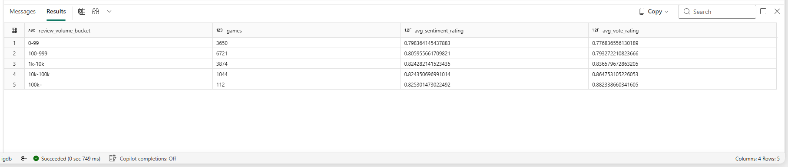

# Where the gap grows

## What this doc covers

The pipeline assigns every game two letter grades from its Steam reviews: a text-sentiment tier (from VADER, an automated reader of review words) and a vote tier (from the recommend / not-recommend thumb). The two letters agree about half the time in low-volume games and almost never agree the same way in high-volume games. This doc walks the volume gradient that makes them disagree, then drills into nine recognizable 100k+ games to show what each disagreement pattern looks like up close.

It does not characterize the per-game gap as its own metric (covered in [sentiment-vote-alignment.md](sentiment-vote-alignment.md)) and it does not restate the smoothing math or tier-cutoff derivation (in [scoring-model.md](../architecture/scoring-model.md)).

The single sentence the doc makes: in the 112 games with 100,000+ reviews, vote tier sits a letter higher than sentiment tier 65.2% of the time and lower 6.3% of the time, and that imbalance grows monotonically across the volume buckets.

## Glossary

| Term | Plain meaning |
|---|---|
| **VADER** | a sentiment scorer that reads a review's words and returns a number from -1 to +1 |
| **text sentiment rating** (`weightedSentimentRating`) | per-game 0-100 score. Influence-weighted average of per-review sentiment directions (positive or negative, derived from each review's VADER compound score) across VADER-eligible reviews, then smoothed |
| **vote rating** (`weightedVoteRating`) | per-game 0-100 score. Influence-weighted average of every thumb (yes / no), then smoothed |
| **influence score** (`reviewInfluenceScore`) | a 0-1 per-review weight blending five signal columns: `communitySignal` (itself a sub-blend of helpful 0.45 / funny 0.20 / comment 0.25 / reaction 0.10 votes), `playtimeSignal`, `lengthSignal`, `emotionalSignal`, `sentimentSignal` |
| **smoothing** (empirical-Bayes shrinkage) | the step that nudges low-volume games toward the dataset average. Formula and priors in `scoring-model.md` |
| **tier ladder** (`weightedSentimentTier`, `weightedVoteTier`) | S ≥ 95, A ≥ 87, B ≥ 78, C ≥ 68, D ≥ 55, F otherwise. "Insufficient Data" fires when the sample count is below 10 |
| **gap** (`sentimentVoteAlignment`) | per-game text sentiment minus vote rating, in points. Negative = vote ran higher. Positive = sentiment ran higher |
| **vote tier higher** | the categorical version of a negative gap: vote letter sits above sentiment letter on the S/A/B/C/D/F ladder |
| **sentiment tier higher** | the categorical version of a positive gap: sentiment letter sits above vote letter |
| **same tier** | both axes land the same letter |
| **% bug mentions** (`pctBugReports`) | share of a game's reviews mentioning *bug, crash, error, lag, stuck,* or *glitch* |
| **% early-access reviews** (`pctEarlyAccess`) | share of reviews written while the game was in Steam's *Early Access* program |
| **% refunds** (`pctRefunded`) | share of reviews written by accounts that refunded the game |

## What tier mismatch looks like

One recognizable 100k+ game per pattern. Each row is a Steam-page letter grade pair: text sentiment first, vote second.

*Source: `Q33-tier-mismatch-explainer.sql`*

| pattern | game | reviews | sentiment (text) | vote (thumbs) | gap |
|---|---|---:|---|---|---:|
| same tier | Cities: Skylines | 125,939 | 89.01 (A) | 92.81 (A) | -3.80 |
| vote tier higher | People Playground | 180,949 | 79.54 (B) | 98.39 (S) | -18.84 |
| sentiment tier higher | Battlefield 2042 | 132,589 | 57.32 (D) | 46.93 (F) | +10.39 |

Cities: Skylines lands both grades on A. People Playground reads as B in the text and S in the thumbs. Battlefield 2042 runs the other way: D in the text, F in the thumbs.

## How the gap shifts with review volume

Bucketing the 15,741 Steam-reviewed games by review count. Mean text sentiment moves 2.6 points across the buckets (79.92 → 82.53). Mean vote rating moves 10.1 (78.14 → 88.23), about four times as much. The gap walks from +1.79 at the bottom to -5.70 at the top, and the spread of the gap (`stddev alignment`) tightens slightly as the bucket grows.

*Source: `Q08-volume-buckets.sql`*

| review-count bucket | games | mean text sentiment | mean vote | mean gap | stddev sentiment | stddev vote | stddev gap |
|---|---:|---:|---:|---:|---:|---:|---:|
| 0-99 | 3,990 | 79.92 | 78.14 | +1.79 | 9.07 | 12.20 | 7.88 |
| 100-999 | 6,721 | 80.60 | 79.33 | +1.27 | 9.05 | 12.33 | 7.29 |
| 1k-9.9k | 3,874 | 82.43 | 83.66 | -1.23 | 8.41 | 11.87 | 7.37 |
| 10k-99k | 1,044 | 82.44 | 86.48 | -4.04 | 7.68 | 10.93 | 7.28 |
| 100k+ | 112 | 82.53 | 88.23 | -5.70 | 7.01 | 10.43 | 6.26 |

A second cut on the same population, scoped to games rated on both axes (each tier non-Insufficient), categorises the gap by tier rather than by points: how often do the two letters land the same, and which letter sits higher when they don't?

*Source: `Q31-tier-mismatch-by-volume.sql`*

| review-count bucket | games rated on both axes | % same tier | % vote tier higher | % sentiment tier higher |
|---|---:|---:|---:|---:|
| 0-99 | 3,644 | 46.3 | 19.8 | 33.9 |
| 100-999 | 6,721 | 51.0 | 21.2 | 27.8 |
| 1k-9.9k | 3,874 | 48.3 | 33.0 | 18.7 |
| 10k-99k | 1,044 | 37.8 | 51.4 | 10.7 |
| 100k+ | 112 | 28.6 | 65.2 | 6.3 |

In the 0-99 bucket the two axes agree on the letter about half the time, with a slight lean toward sentiment higher (33.9 vs 19.8). The lean has flipped by the 1k-9.9k bucket and grows in every step after. In the 100k+ bucket the axes disagree on the letter in 71.4% of games, and when they disagree it is overwhelmingly the vote letter that sits above (65.2 of the 71.4).

## A closer look at each pattern

The 9 games below come from the 100k+ bucket. Same-tier picks span the A and B rows of that group; vote-higher picks span one-letter and two-letter shifts; sentiment-higher picks are three of the seven 100k+ games sitting in that pattern.

*Source: `Q32-tier-mismatch-drilldown.sql`*

### Same tier

| game | reviews | sentiment (text) | vote (thumbs) | gap | % bug mentions | % refunds | genres / themes |
|---|---:|---|---|---:|---:|---:|---|
| Skyrim - Special Edition | 212,477 | 87.42 (A) | 91.66 (A) | -4.25 | 6.15 | 0.13 | Adventure, RPG / Action, Fantasy, Historical, Open world, Sandbox |
| Rocket League | 300,320 | 82.82 (B) | 85.21 (B) | -2.38 | 1.91 | 0.18 | Indie, Racing, Sport / Action, Sci-fi |
| Sid Meier's Civilization VI | 146,912 | 84.60 (B) | 84.62 (B) | -0.01 | 5.16 | 0.15 | Simulator, Strategy, TBS / 4X, Fantasy, Historical |

Bug mentions sit in the 2-6% band, refund rates near zero, gap inside 5 points across all three rows. Civ VI's gap of -0.01 is the cleanest agreement in the drill-down.

---

### Vote tier higher

| game | reviews | sentiment (text) | vote (thumbs) | gap | % bug mentions | % refunds | genres / themes |
|---|---:|---|---|---:|---:|---:|---|
| Helldivers 2 | 794,791 | 77.32 (C) | 81.69 (B) | -4.37 | 11.66 | 0.42 | Shooter, Tactical / Action, Sci-fi |
| Left 4 Dead 2 | 309,333 | 85.28 (B) | 97.32 (S) | -12.04 | 1.09 | 0.07 | Shooter / Action, Horror, Survival |
| The Binding of Isaac: Rebirth | 156,024 | 81.24 (B) | 96.82 (S) | -15.59 | 1.08 | 0.16 | Adventure, Arcade, Indie, Puzzle, RPG, Shooter / Action, Comedy, Fantasy, Horror |

Helldivers 2 has the highest bug-mention rate in the drill-down (11.66%) and a one-letter shift. Left 4 Dead 2 and The Binding of Isaac shift two letters: text reads B, thumbs read S. Both have refund rates under 0.2 and bug rates near 1.

---

### Sentiment tier higher

| game | reviews | sentiment (text) | vote (thumbs) | gap | % bug mentions | % refunds | genres / themes |
|---|---:|---|---|---:|---:|---:|---|
| New World: Aeternum | 173,355 | 74.79 (C) | 65.70 (D) | +9.09 | 12.79 | 0.22 | Adventure, RPG / Action, Sandbox |
| Halo Infinite | 141,793 | 73.52 (C) | 67.08 (D) | +6.44 | 7.99 | 0.01 | Adventure, Shooter / Action, Open world, Sci-fi, Warfare |
| Black Desert | 100,991 | 78.64 (B) | 72.51 (C) | +6.13 | 4.14 | 0.47 | Adventure, Hack and slash, RPG, Strategy / Action, Fantasy, Historical, Open world, Sandbox |

Three of the seven 100k+ games where sentiment ran above vote, all live-service titles. The shift is one letter in every case (C→D twice, B→C once). Bug-mention rates range from 4 to 13, well above the same-tier picks. The alignment doc reads the same shape at game grain through other titles in this group (Starfield, Borderlands 4, Monster Hunter Wilds).

## Sources

- Queries: `Q08-volume-buckets.sql` (volume-bucket means and stddevs), `Q31-tier-mismatch-by-volume.sql` (tier-agreement rates by bucket), `Q32-tier-mismatch-drilldown.sql` (per-pattern game drill-down), `Q33-tier-mismatch-explainer.sql` (one game per pattern)
- Charts: `A08_volume_vs_quality.png` (in [Docs/exports/02_Analytics/](../exports/02_Analytics/))
- Reproduce via: [DuckDB/](../../DuckDB/) (DuckDB harness over Gold parquet exports)
- Methodology: [scoring-model.md](../architecture/scoring-model.md) (§ *sentimentVoteAlignment*, § *Tier calibration*, § *Bayesian shrinkage with empirically-derived priors*)
- Companion finding: [sentiment-vote-alignment.md](sentiment-vote-alignment.md) (the per-game gap as its own metric, with negative-tail and positive-tail leaderboards plus reviewer-text drill-downs)
- Caveats:
  - All ratings are post-shrinkage. Raw values diverge from smoothed values at small N.
  - Q31's denominator is games where both `weightedSentimentTier` and `weightedVoteTier` are non-Insufficient. The 0-99 bucket loses 346 games to that filter (3,990 games but 3,644 with both axes rated); other buckets lose none.
  - Sentiment and vote tiers use different sample-count denominators (`sentimentReviews` for sentiment, `totalReviews` for vote), so a small number of games can land Insufficient on one axis but not the other.
  - All 9 drill-down picks carry 0% early-access reviews; the early-access cluster sits below the 100k+ threshold and is covered in the alignment doc's refunds section.
  - Drill-down picks were chosen to avoid duplication with `sentiment-vote-alignment.md`'s tables. Battlefield 2042 (used in the explainer table) appears in both docs but under different framings: alignment reads its +10.39 point gap; this doc reads its lone D→F tier shift in the 100k+ bucket.
  - Genres / themes pulled from `gold.vw_gameCatalogue` with `'Unknown'` (IGDB placeholder) stripped. The view is cartesian, so Q32 deduplicates `(gameKey, themeName)` and `(gameKey, genreName)` in CTEs before `STRING_AGG`. Some IGDB labels abbreviated for table width: "Role-playing (RPG)" → RPG, "Turn-based strategy (TBS)" → TBS, "Hack and slash/Beat 'em up" → Hack and slash, "Science fiction" → Sci-fi, "4X (explore, expand, exploit, and exterminate)" → 4X.
