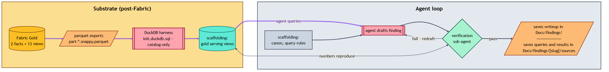

# Agentic analytics over exported lakehouse

## What this is

This layer was made after the Fabric trial ran out. Fabric covered the production pipeline through expiry; with cluster capacity gone, the Gold parquet exports were loaded into a local DuckDB harness to keep ad-hoc analytics running. The agentic loop runs against that harness, with three artifacts as scaffolding: a domain canon ([`agent-orientation-primer.md`](agent-orientation-primer.md)), this methodology, and a query-rules doc ([`query-rules.md`](query-rules.md)).

*The DuckDB harness scans the Fabric Gold parquet exports and rebuilds the `gold.vw_*` serving views; the agent queries those views (canon + query-rules in hand), drafts a finding, and a verification sub-agent reproduces the cited numbers against the views before it is filed under `Docs/findings/`.*

## Scaffolding

### 1: Domain Canon

The orientation primer defines every column the agent had access to: naming conventions (`signal` means 0-1 per-review, `rating` means smoothed game-grain), the per-convention YAML contracts, exceptions where a column breaks its convention, and a full term-by-term glossary. This is the canon the agent reads before composing a query. [`agent-orientation-primer.md`](../DuckDB/agent-orientation-primer.md).

### 2: The repo

A medallion lakehouse with clean separation between schema-resilient Bronze, scored Silver, dimensional Gold base tables, and a 13-view Gold serving layer. The architecture is documented in [`../Docs/architecture/overview.md`](../Docs/architecture/overview.md); the per-game scoring math in [`../Docs/architecture/scoring-model.md`](../Docs/architecture/scoring-model.md).

### 3: Query rules

A separate file holds prescriptive must-follow patterns: the `gameKey`-first query pattern (query efficiency), and the `vw_gameCatalogue` cartesian dedup trap. These are not embedded in the methodology. They live next to it, scoped to agent consumption, so they can evolve as new traps surface without rewriting the prose. [`query-rules.md`](../DuckDB/query-rules.md).

### Verification sub-agents

Drafts are audited before they ship. A verification sub-agent re-reads each draft against the primer's term definitions and the underlying parquet data. It checks that column meanings line up, joins have not introduced multi-counts, and that any cited number reproduces from the harness. 

On 2026-05-10, this audit caught real semantic drift across the findings layer: a term used inconsistently across multiple docs. Findings were corrected before they were filed under [`../Docs/findings/`](../Docs/findings/).

### Outcome

The six findings the loop produced, each cited here by name:

- [`edge-cases.md`](../Docs/findings/edge-cases.md): the games where weighted sentiment and weighted vote rating diverge most sharply.
- [`funny.md`](../Docs/findings/funny.md): joke-review patterns and how they survive the scoring layer.
- [`protest-reviews.md`](../Docs/findings/protest-reviews.md): what coordinated review-bombing looks like in the influence-weighted output.
- [`sentiment-vote-alignment.md`](../Docs/findings/sentiment-vote-alignment.md): the per-game gap between text-sentiment and recommend-vote ratings.
- [`what-sentimentrating-reveals.md`](../Docs/findings/what-sentimentrating-reveals.md): what the smoothed text-sentiment leaderboard surfaces about audience taste.
- [`where-the-gap-grows.md`](../Docs/findings/where-the-gap-grows.md): how the sentiment-vote gap scales with audience size.

## What the loop earns

**Visible flow.** Every step of the loop is committed: the repo, the canon, the rules, the findings. Findings can be traced back through the primer's term definitions to the underlying parquet column.

**Collaboration without losing rigor.** The agent traverses the canon faster than a human reading raw view DDLs and follows the query rules without forgetting them mid-session. It does not judge which finding is worth shipping, decide framing for a non-technical audience, or catch a misread of intent. The verification sub-agents close part of the loop; the human reviewer closes the rest.

**Reusable scaffolding.** Any structured lakehouse with column-meaning drift across docs is a candidate for the same pattern: a domain canon, prescriptive query rules, a verification step. The loop scales to larger surfaces by carving the canon into per-domain slices.
