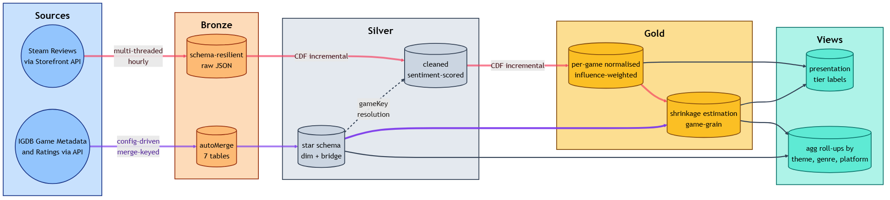

# Altanwir

*Using Microsoft Fabric, i ingested 71M Steam reviews × IGDB game metadata into a Medallion lakehouse (three layers: raw, cleaned, analytics). The full ingestion took 2h28m on an 8-core trial cluster. The text in those 71M reviews disagrees with the thumbs (positive or negative review), and the disagreement has a shape.*


> [!NOTE]
> This is a learning project. The architecture choices reflect a re-entry exercise into modern data engineering after previous experience with on-prem BI.

## Contents

- [Overview](#overview)
- [Findings](#findings)
- [Repository layout](#repository-layout)
- [Tech stack](#tech-stack)
- [Limitations](#limitations)

---

## Overview

<a href="Docs/architecture/diagrams/architecture-summary.png"></a>

*Full pipeline + legend: [`overview.md#diagram`](Docs/architecture/overview.md#diagram).*

Three layers: Bronze (raw), Silver (cleaned), Gold (analytics).

- Bronze ingests Steam JSON and IGDB metadata, both schema-resilient. Steam's schema drifts every few months; the loader doesn't care.
- Silver does the heavy work: an 8-step text-cleaning chain, then VADER (rule-based lexicon that extracts sentiment polarity) over the cleaned body, gated on `isVaderEligible` and `hasCredibleText` so the scorer never sees obvious junk reviews. Bridge tables in Silver handle the many-to-many relationships between games and igdb metadata.
- Gold rolls up to game grain with influence-weighting and shrinkage, so a 5-review indie does not outrank a 50,000-review behemoth. IGDB aggregated ratings get the same treatment (formulas in [`scoring-model.md`](Docs/architecture/scoring-model.md)).

After the first full load, the reviews pipeline is incremental. Change Data Feed (CDF) ships changes from Silver onward, and watermarks live in a separate Fabric SQL Warehouse. The audit plane runs off-Spark, so observability and audit reads do not spin up a cluster.

Three ADRs cover the key decisions that shaped the pipeline:

| ADR | One-line gist |
|---|---|
| [adr-001](Docs/adrs/adr-001-dimensional-gold-over-array-obt.md) | Dimensional Gold over array-OBT. Fabric's SQL endpoint cannot surface complex types, so the model goes Kimball-aligned star schema all the way down. |
| [adr-002](Docs/adrs/adr-002-cdf-incremental-audit-warehouse.md) | CDF incremental with a separate audit warehouse. Watermark reads do not spin up a Spark cluster, and the audit plane runs observability off-Spark. |
| [adr-009](Docs/adrs/adr-009-review-scraper-bronze-loader-decoupling.md) | Steam reviews are scraped and stored in OneLake as audited batches. A decoupled pipeline processes new additions at regular intervals. |

*9 ADRs total in [`Docs/adrs/`](Docs/adrs/), with 11 minor calls in [`decisions.md`](Docs/decisions.md).*

## Findings

Steam ranks games by thumb-up percentage. The text doesn't get counted. At 71M reviews, that's a lot of unread evidence, and the gap between what the thumb says and what the text says has a shape worth measuring.

> [!IMPORTANT]
> The pipeline exists to answer a question: do the words in Steam reviews agree with the thumbs? The architecture is the method. The findings below are the answer.

Thumbs and text often disagree, and the disagreement is structured. The text reads angrier on punishing-difficulty games and milder on disappointing AAA launches (big-studio releases). Doom sits 21 points below its thumb; Starfield sits 17 above it. The shape repeats at genre and theme grain. Both scores land on a 0-100 scale in `vw_factGameScores` (`weightedSentimentRating` and `weightedVoteRating`; formulas in [`scoring-model.md`](Docs/architecture/scoring-model.md)).

Three finding docs walk through what surfaced:

- [`sentiment-vote-alignment.md`](Docs/findings/sentiment-vote-alignment.md): the per-game gap between the two axes, with recognizable extremes (Doom −21.16 on the angry-text side, Starfield +16.64 on the mild-text side) and the theme-grain pattern behind them.
- [`where-the-gap-grows.md`](Docs/findings/where-the-gap-grows.md): the gap grows monotonically with audience size. In games with 100k+ reviews, the two letter grades disagree on 71% of titles.
- [`what-sentimentrating-reveals.md`](Docs/findings/what-sentimentrating-reveals.md): the smoothed text-sentiment leaderboard reads cozy and short-narrative (A Short Hike 96.75, Tiny Glade 96.21), with the same shape at theme and genre grain.

*6 findings total, in [`Docs/findings/`](Docs/findings/).*

## Repository layout

```
Altanwir/
├── README.md
├── Docs/
│   ├── architecture/
│   │   ├── overview.md              # full writeup + diagram + field-lineage table
│   │   └── scoring-model.md         # VADER eligibility, influence score, shrinkage
│   ├── adrs/                        # 9 ADRs (Context / Decision / Rationale / Trade-offs)
│   ├── decisions.md                 # 11 lightweight calls that didn't need a full ADR
│   ├── findings/                    # 6 analytical writeups
│   └── quirks/                      # implementation quirks and workarounds (Fabric, Spark, VADER)
├── DuckDB/
│   ├── README.md
│   ├── agentic-analytics.md         # the agent-loop methodology
│   └── init.duckdb.sql              # harness over Gold parquet exports
├── Fabric/                          # Spark notebooks + Data Factory pipelines
│   ├── NB_Steam_Reviews.Notebook/   # API extractor (plain Jupyter, not Spark)
│   ├── NB_Steam_Reviews_Bronze.Notebook/
│   ├── NB_Steam_Reviews_Silver.Notebook/
│   ├── NB_Steam_Reviews_Gold.Notebook/
│   ├── NB_Game_Scores_Gold.Notebook/
│   ├── NB_1_Bronze.Notebook/        # IGDB loader
│   ├── NB_2_Silver.Notebook/        # IGDB dim + bridge build
│   └── pl_*.DataPipeline/           # 4 orchestration pipelines
└── Labs/                            # local prototyping (DuckDB, dbt, Fabric PoCs)
```

## Tech stack

Lakehouse on Azure (Microsoft Fabric). The Spark + Delta + Parquet patterns are directly portable to Databricks.

- **Cloud / platform**: Microsoft Fabric on Azure
- **Compute**: Apache Spark (PySpark)
- **Storage / format**: Delta Lake, Apache Parquet
- **Languages**: Python, SQL
- **Sentiment**: VADER (vaderSentiment)
- **Query layer**: DuckDB (post-Fabric portability)
- **Orchestration**: Microsoft Fabric Data Factory
- **Audit plane**: Fabric SQL Warehouse (off-Spark)

## Limitations

- **No semantic layer.** Presentation logic (tier labels, scaled ratings) lives in Gold serving views, not in a Power BI semantic model with DAX measures. The trade-off was scope: the project was scoped to PySpark/Fabric end-to-end.
- **No time-series, no DLC grouping, no patch/version segmentation.** The grain stays one row per game, static. Adding any of these would require IGDB fields not currently fetched and a non-trivial schema change.
- **No cross-platform IGDB↔Steam analysis.** No canonical mapping between IGDB platform ids and Steam app ids exists. `vw_aggPlatforms` is IGDB-only as a result.
- **IGDB Bronze and Silver notebooks are the first Python written on this project.** They predate the patterns the Steam notebooks use: no `environment` parameter, no PARAMETERS-cell runtime overrides, ad-hoc credential handling. They work and shipped to prod; the Steam chain is the cleaner reference.
